# Dealer Evaluation — Cloud Native Modernization Capstone

The final capstone project for IBM's **Cloud Native, Microservices, Containers, DevOps and Agile** course (part of the [IBM Hybrid Cloud Architect Professional Certificate](https://www.coursera.org/professional-certificates/ibm-hybrid-cloud-architect) on Coursera).

## About this project

This project simulates a real-world scenario: taking an existing Java/Spring Boot application (**Dealer Evaluation**, which compares product prices across dealers) and modernizing it for a cloud-native environment. The work follows the full lifecycle a Cloud Native / DevOps engineer would actually perform — planning the modernization as Agile user stories, containerizing the application, deploying it to the cloud, enhancing the code, and redeploying the changes.

> **Note:** This project is not a test of Java programming ability — the goal was to demonstrate the process of planning, containerizing, deploying, enhancing, and redeploying a real application, which is the core workflow of working in a cloud-native, microservices, and CI/CD environment.

## Skills demonstrated

- Cloning and running an existing Spring Boot application with Maven
- Writing Agile **user stories** to plan application modernization work
- Containerizing an application with **Docker**
- Deploying a containerized application to **IBM Cloud** (via IBM Cloud Container Registry and Code Engine)
- Refactoring code to remove hard-coded data in favor of external, editable JSON configuration
- Rebuilding, redeploying, and verifying changes in a live cloud environment

## The six tasks

**Task 1 — Create application:** Cloned the Dealer Evaluation repository and ran it locally with `mvn spring-boot:run` to confirm it worked before making any changes.

**Task 2 — Plan application modernization:** Wrote an Epic and three user stories (see [`user-stories/user-stories.md`](./user-stories/user-stories.md)) covering containerization, cloud deployment, and removing hard-coded data — following the standard "As a [role], I want [function], so that [benefit]" format.

**Task 3 — Containerize the application:** Wrote a Dockerfile using `openjdk:21-jdk-slim`, built the application with Maven, and packaged it into a Docker image. Verified the containerized app ran correctly on `localhost:8080` before deploying anywhere.

**Task 4 — Deploy on IBM Cloud:** Pushed the Docker image to IBM Cloud Container Registry and deployed it as a live application on IBM Cloud Code Engine, accessible via a public HTTPS URL.

**Task 5 — Read products and dealers from JSON:** Refactored `DealerService.java` and `ProductService.java` to remove hard-coded, inline product and dealer data, replacing it with JSON files (`dealers.json`, `products.json`) loaded from the classpath and deserialized with Jackson's `ObjectMapper` — directly implementing User Story 3.

**Task 6 — Deploy changes on IBM Cloud:** Rebuilt the application and Docker image with the JSON-based data changes, pushed the updated image to IBM Cloud Container Registry, and redeployed it via `ibmcloud ce application update`, confirming the live application reflected the update.

## Before and after: the key code change

**Before** — hard-coded data directly in the service class:
```java
private DealersDTO getData() {
    var dealers = new DealersDTO();
    List<DealerDTO> dealersList = Arrays.asList(
        new DealerDTO("Binglee", Map.of("Headphones", "$30", "Printer", "$75")),
        // ...more hard-coded entries
    );
    dealers.setDealers(dealersList);
    return dealers;
}
```

**After** — data loaded from an external JSON file:
```java
private DealersDTO getData() {
    try {
        String json = JsonReader.readJsonFromClasspath("json/dealers.json");
        return objectMapper.readValue(json, DealersDTO.class);
    } catch (Exception e) {
        return null;
    }
}
```
The same pattern was applied to `ProductService.java`. This change means dealer and product data can now be updated by editing a JSON file — no code changes or Java rebuild logic required to change what data the application serves.

## Screenshots

| Task | Screenshot |
|---|---|
| Code Engine project ready | 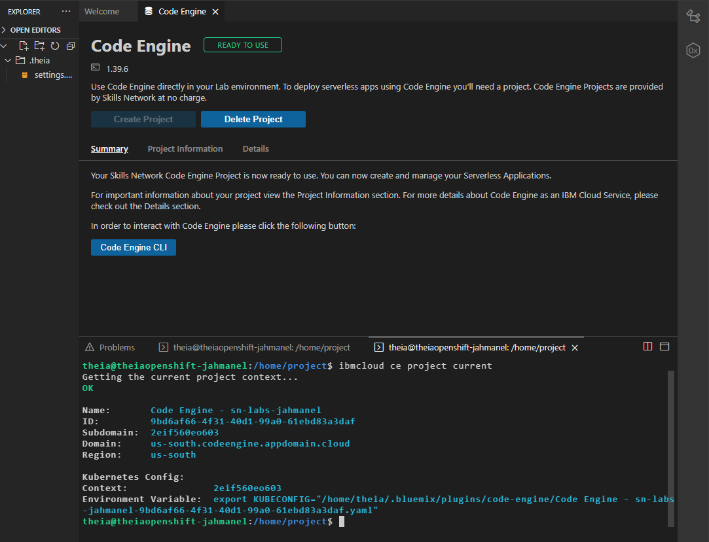 |
| Cloning and running the app locally | 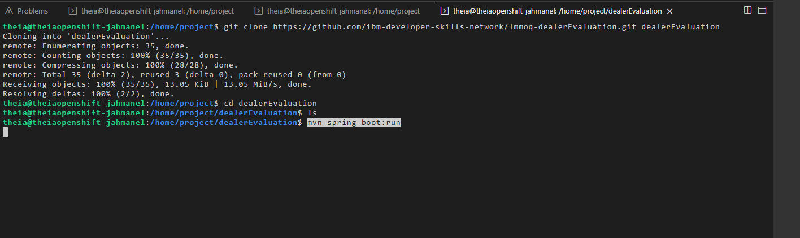 |
| App running with original hard-coded data | 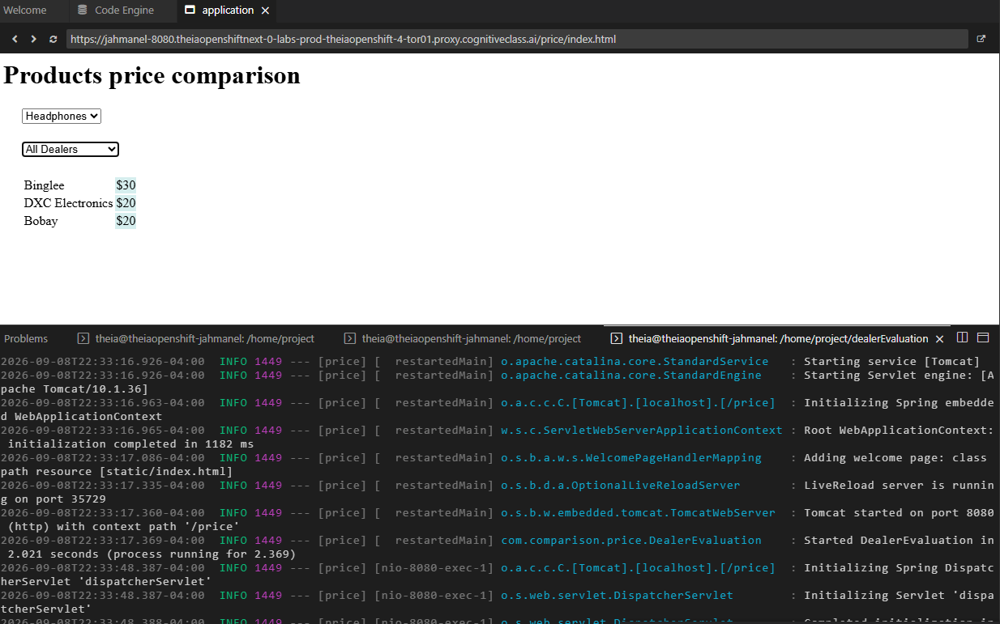 |
| Dockerfile and Maven build | 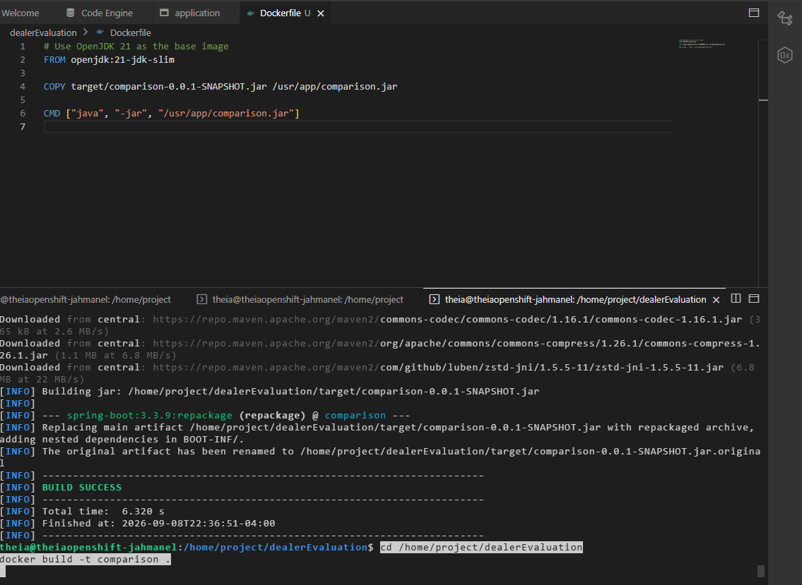 |
| Docker build and run locally | 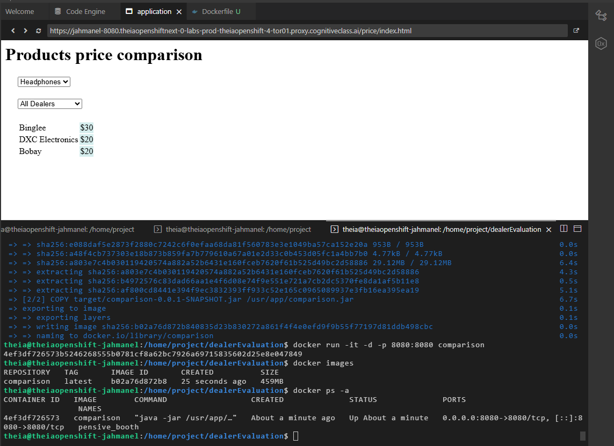 |
| Container verified and stopped | 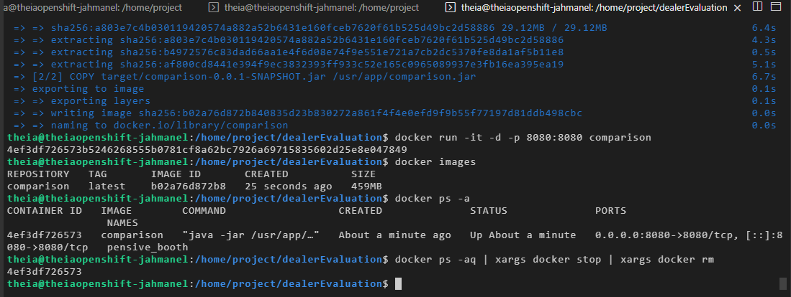 |
| Pushed to IBM Cloud Container Registry | 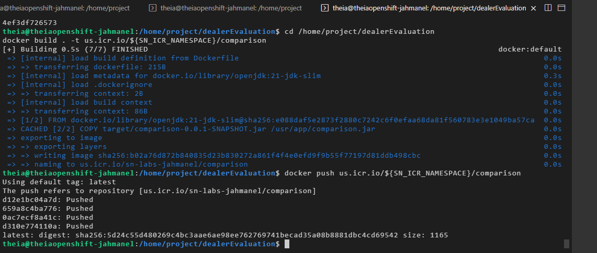 |
| Deployed to IBM Cloud Code Engine | 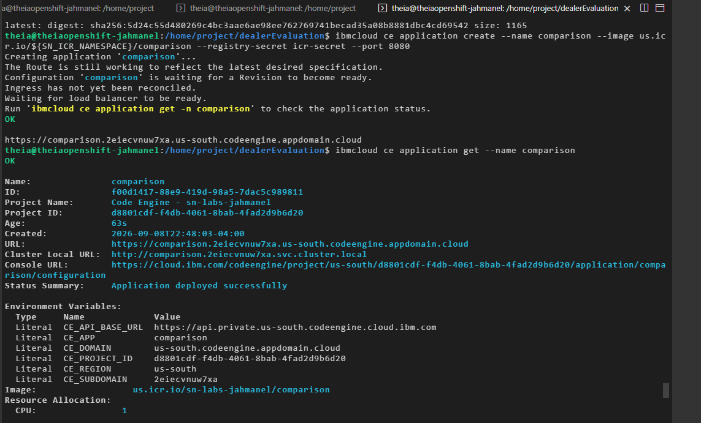 |
| Live application on IBM Cloud | 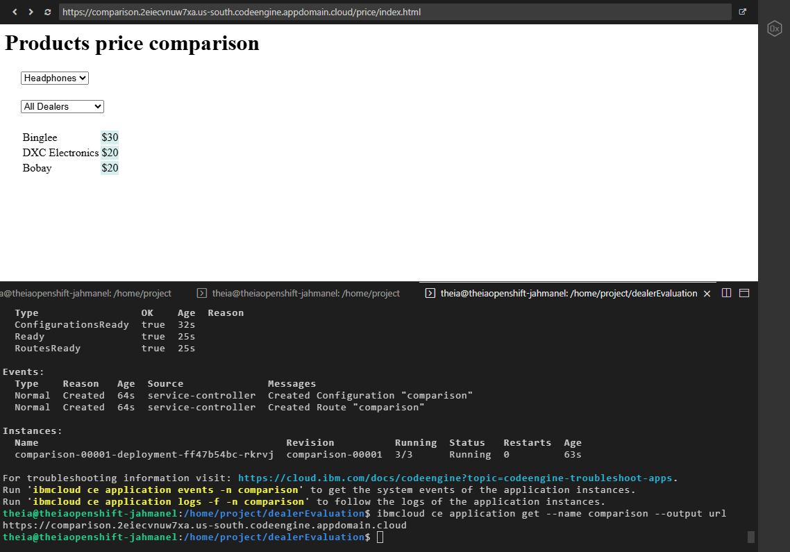 |
| `DealerService` updated to read from JSON | 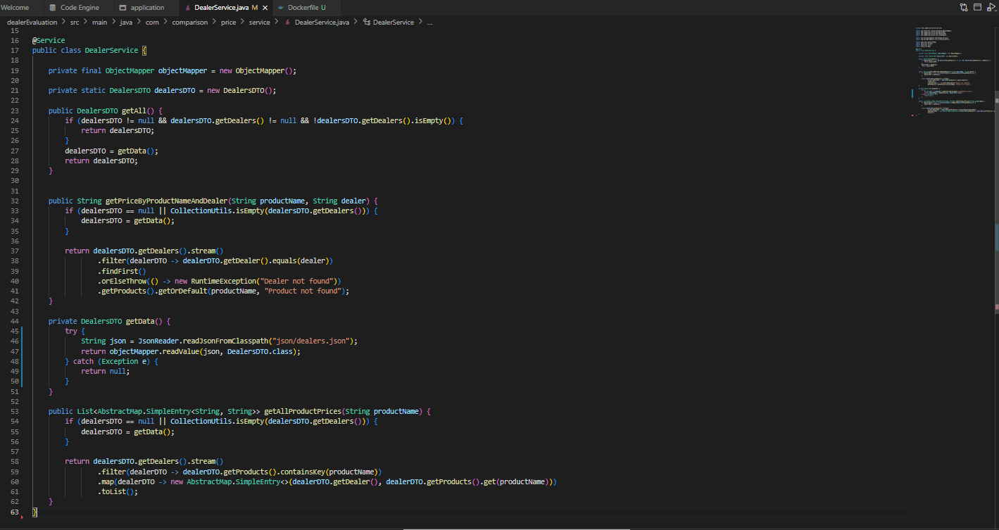 |
| `ProductService` updated to read from JSON | 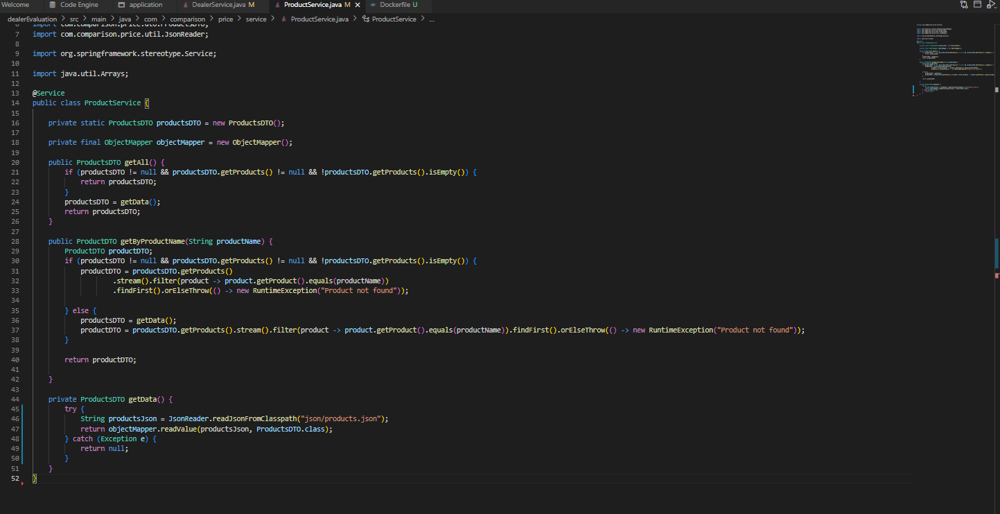 |
| Rebuilt and pushed updated image | 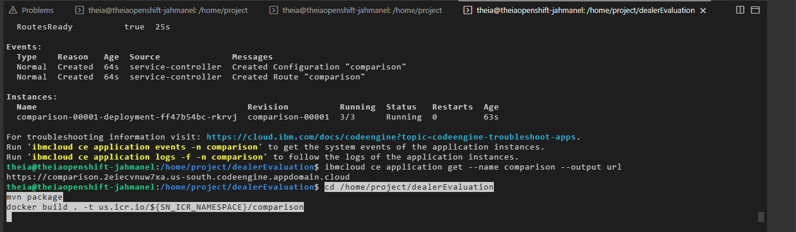 |
| Redeployed updated application | 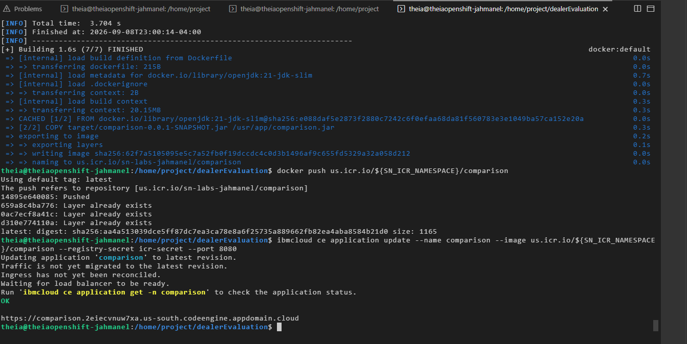 |

## Tech used

`Java` · `Spring Boot` · `Maven` · `Docker` · `IBM Cloud Container Registry` · `IBM Cloud Code Engine` · `Jackson (ObjectMapper)` · `Agile / User Stories`

## Credit

Starter application code provided by [IBM Developer Skills Network](https://github.com/ibm-developer-skills-network/lmmoq-dealerEvaluation). The user stories, containerization, cloud deployment, and JSON refactoring were completed by me as the final capstone project for the course.

---

*Elijah Cordova — working toward a DevOps/Cloud Engineering role. Capstone project for the [IBM Hybrid Cloud Architect Professional Certificate](https://www.coursera.org/professional-certificates/ibm-hybrid-cloud-architect).*
